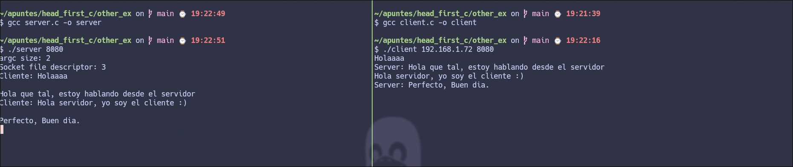
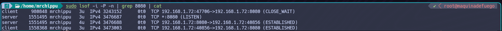

Este repositorio incluye una representacion sencilla de como funcionan los sockets, desarollado en lenguaje C y probado en una PC con OS basado en linux (Específicamente, Manjaro Linux).

Con propositos de aprendizaje y recreativo, solo simula la conexión entre un cliente y un servidor a través de un socket TCP (El usuario es quien decide el puerto que será escuchado).

## Archivos 📁
- `server.c`: Código fuente del servidor TCP.
- `client.c`: Código fuente del cliente TCP.


##  Cómo compilar 🚀

```bash
gcc server.c -o server
gcc client.c -o client
```

## Uso:
**Cliente:**
```bash
./cliente <IP_host> <port>
```
**Servidor:**
```bash
./server <port>
```

## Screenshot de Ejemplo:



## Muestra de apertura de puertos locales:


